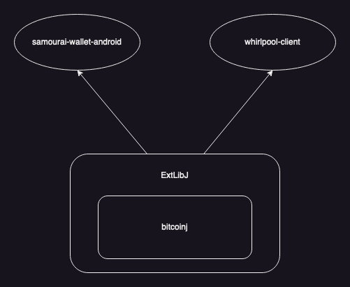

[](https://jitpack.io/#io.samourai.code.wallet/ExtLibJ)

# ExtLibJ
BitcoinJ extensions: BIP39/44/47/49/84, bech32, PSBT (BIP174).

See [documentation](README-DOC.md)




## Build
Build with Maven:
```
mvn clean install -Dmaven.test.skip=true
```

Build & Run JUnit Tests with Maven:
```
mvn clean install
```


## Run JUnit Tests
Run JUnit Tests with Maven:
```
mvn clean test
```

Run JUnit Test Class with Maven:
```
mvn clean test -Dtest=xxxxTest
```

Run JUnit Test Classes with Maven:
```
mvn clean test -Dtest=xxxxTest1,xxxxTest2
```

Run JUnit Test Method with Maven:
```
mvn clean test -Dtest=xxxxTest#testA
```

Run JUnit Test Methods with Maven:
```
mvn clean test -Dtest=xxxxTest#testA+testB
```